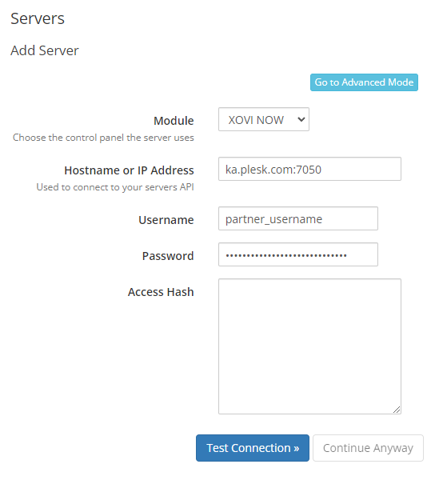

# XOVI NOW WHMCS provisioning module

## Description

XOVI NOW WHMCS provisioning module gives the ability to sell the SEO solution.

## Requirements

The minimum required PHP version is 7.4.

For the latest WHMCS minimum system requirements, please refer to <https://docs.whmcs.com/System_Requirements>.

## Installation

* Download the latest zip archive from the [releases page](https://github.com/plesk/whmcs-xovinow/releases)
* Extract the contents of the zip file in the WHMCS root directory; the module will be extracted to `/modules/servers/xovinow`
* Remove the zip file afterward

## Server setup

The module uses the Plesk Key Administrator Partner API 3.0. To configure the module, go to Products/Services -> Servers and add a new server with the credentials:

## Product setup

After server setup is done, go to Products/Services and add a new product group e.g. `SEO`. Then create a new product:

and configure it further in the Module Settings:

## Product upgrades/downgrades

You can also configure product upgrades, but it is only allowed to upgrade from a lower plan to a higher plan (e.g. Pro -> Business -> Enterprise). A downgrade from the higher plan to a lower plan (e.g. Business -> Pro) is restricted by the Plesk Key Administrator.

## Email template customization

The XOVI NOW license can be activated through the client area or by sending the activation link in the "New Product Information", which by default is the "Other Product/Service Welcome Email". To do so:

* Go to Configuration -> Email Templates
* Edit the "Other Product/Service Welcome Email" in the "Product/Service Messages" group
* Add the placeholder `{$service_custom_field_activationurl}` to the template, e.g. `{if isset($service_custom_field_activationurl)}If not already done please activate the product here: {$service_custom_field_activationurl}{/if}`

## Troubleshooting

In case of problems look at the System Logs -> Module Log.

## Copyright

Copyright 2023. [Plesk International GmbH](https://www.plesk.com). All rights reserved.
